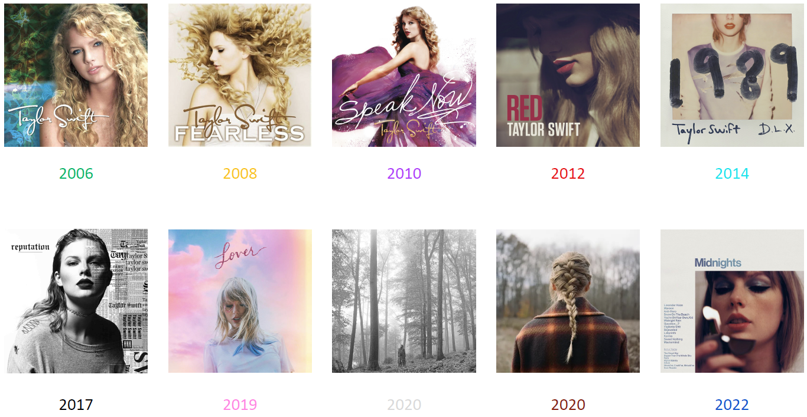
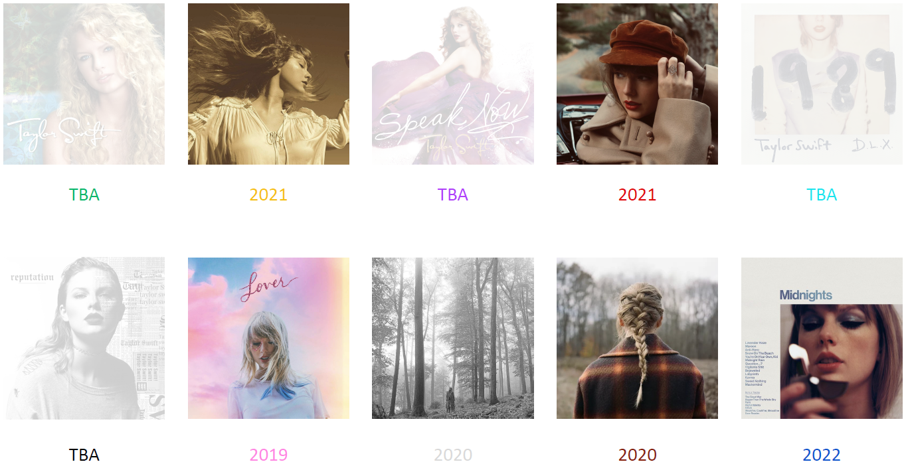
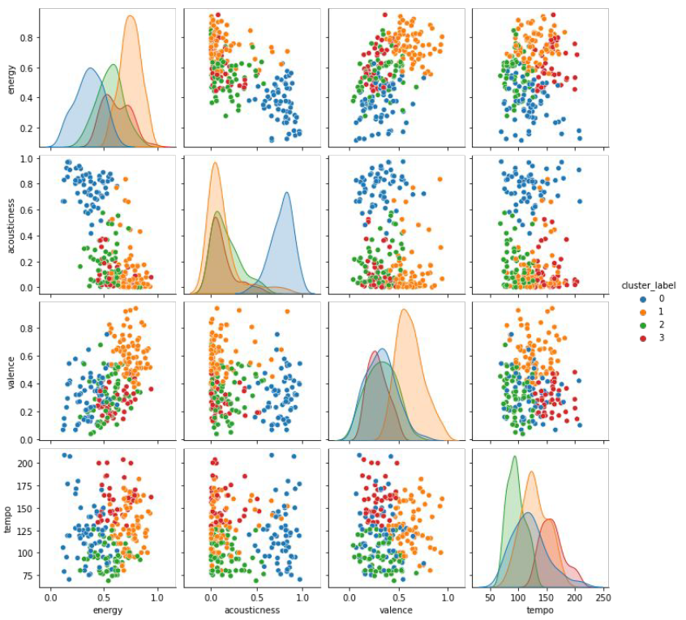
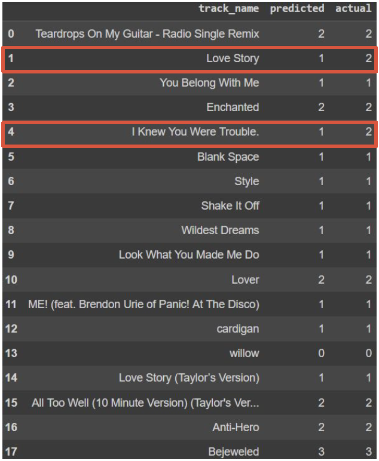

# Data exploration and analysis

based on Taylor Swift discography

co-made with [@kingapyrek](https://github.com/kingapyrek)

---

## Data

All data were scrapped with Spotify API.

Dataset includes 10 studio albums (deluxe versions if possible) and 2 re-recorded studio albums.

There are columns describing songs (title, album, release date, length etc.) as well as numerical data connected with music analysis (loudness, acousticness, energy, valence etc. - computed by Spotify).

## Analysis

Operations made:
* statistics of columns, histograms, percent of incomplete data
* correlation matrix
* outliers detection
* clusterization (with k-means algorithm)
* classification (with k nearest neighbours algorithm).

## Clusterization

4 main clusters have emerged:

* blue (0)
  - energy: low/medium (up to 0.65)
  - acousticness: high (from 0.5)
  - valence: mainly sad
  - tempo: mainly medium

* orange (1)
  - energy: high (0.5 - 1.0)
  - acousticness: mainly low
  - valence: mainly positive
  - tempo: medium (60 - 200)

* green (2)
  - energy: medium (0.3 - 0.9)
  - acousticness: low (up to 0.55)
  - valence: mainly sad
  - tempo: mainly low (50 - 140)

* red (3)
  - energy: medium/high (0.4 - 0.95)
  - acousticness: mainly low
  - valence: sad (up to 0.5)
  - tempo: medium/high (110 - 230)
  

## Classification

Some of the most popular songs were taken out of dataset. As an input KNN (`k=4`) algorithm was given all songs without the selected ones with their labels and then classification was made.
Results are good since only two songs have been mislabelled.

